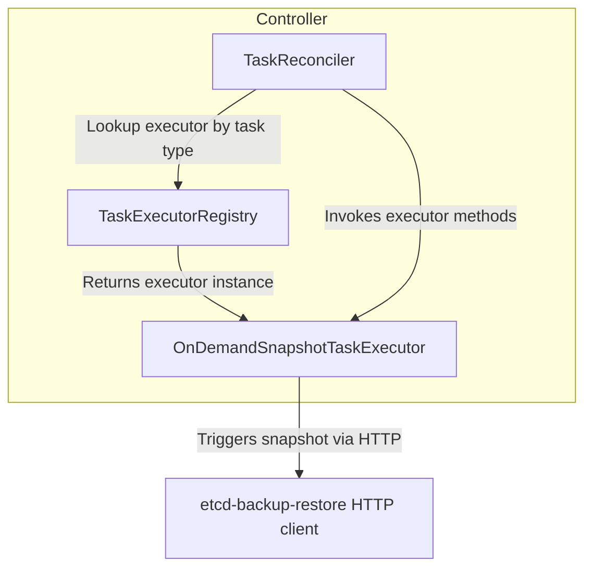

# EtcdOperatorTask Controller Design

## 1. Task Categories

We classify operator tasks into four main categories, based on how they interact with etcd and their execution requirements:

| **Category**                            | **Description**                                                                                | **Examples**                                                                         | **Execution Context**             |
| --------------------------------------- | ---------------------------------------------------------------------------------------------- | ------------------------------------------------------------------------------------ | --------------------------------- |
| **1. etcd-backup-restore Subcommands**  | Tasks that leverage `etcd-backup-restore` CLI/subcommands, sometimes running an embedded etcd. | Copying/compacting snapshots                                                         | Standalone Kubernetes Jobs.       |
| **2. etcd-backup-restore Sidecar HTTP** | Tasks that require the sidecar container to handle snapshot creation via HTTP endpoints.       | On-demand full/delta snapshots, Etcd Maintenance ops(Compaction and Defragmentation) | HTTP call to sidecar in etcd Pod. |
| **3. etcd Client Operations**           | Maintenance tasks issued via `etcdctl` or compatible client libraries.                         | Leadership change, removing member etc                                               | Etcd Client call.                 |
| **4. Kubernetes API Tasks**             | Tasks that manipulate Kubernetes resources for cluster-wide or disruptive actions.             | Quorum loss recovery, migration, PVC management                                      | Operator using K8s API.           |

---

## 2. Controller Placement: Alternatives

We propose creating a new controller (and reconciler) for handling out-of-band etcd task operations. The controller follows a multi-step reconciliation flow similar to the existing etcd controller:
There are two potential options for the **operator task controller**:
- Running the operator task controller inside the leading etcd-backup-restore container. It would watch for events related to specific (or all) task types.
- Running the operator task controller inside etcd-druid, watching for events related to specific (or all) task types.

| **Task Type**                                      | **etcd-backup-restore (Leader) Operator Controller**                                                                                           | **etcd-druid Operator Controller**                                             |                                             |
| -------------------------------------------------- | ---------------------------------------------------------------------------------------------------------------------------------------------- | ------------------------------------------------------------------------------ | ------------------------------------------- |
| **Type 1: Compaction**                             | N <br> (Not ideal because compaction starts an embedded etcd)                                                                                  | Y – Triggered as a Kubernetes Job using `etcdbrctl compact`                    |                                             |
| **Type 1: Copy**                                   | Y – Invokes internal APIs to perform copy                                                                                                      | Y – Executes as a Kubernetes Job using `etcdbrctl copy`                        |                                             |
| **Type 2: Full/Delta Snapshots , Maintenance Ops** | Y – Invokes internal APIs                                                                                                                      | Y – Uses an HTTPS client to communicate with the etcd-backup-restore container |                                             |
| **Type 3/4: Etcd Migrations**                      | N – Not applicable because etcd-backup-restore itself is not running and we prefer not to create k8s client from backup-restore for migrations | Y – Managed via etcd and Kubernetes client operations                          |                                             |
| **Type 4: Quorum Recovery**                        | N – No leader exists for quorum recovery                                                                                                       | Y – Handled through direct interactions with the Kubernetes API                |                                             |

---

## 3. Recommended Architecture

We propose implementing the **EtcdOperatorTask** controller as part of `etcd-druid` (the operator):

- **Centralised orchestration**: All task logic and status in one place, improving discoverability and coordination.
- **Full K8s API access**: Operator can scale/update resources as needed.
- **Safe coordination**: Operator can pause main etcd reconciliation during disruptive tasks, minimising risk.

If a task requires the `etcd-backup-restore` container, the operator can coordinate via HTTP endpoints, ensuring no conflicts with scheduled operations.

---

## 4. Controller Structure & Extensibility

### Key Components

- **TaskReconciler**: Main reconciliation loop, manages lifecycle of EtcdOperatorTask resources.
- **TaskExecutorRegistry**: Registry mapping task types to their executors, enabling easy extensibility.
- **TaskExecutor**: Interface for implementing task-specific logic (preconditions, execution, cleanup).

#### Component Diagram


---

### TaskExecutor Interface

Defines the contract for all task executors:

```go
type TaskExecutor interface {
    CheckPreconditions(ctx context.Context, task *EtcdOperatorTask) (bool, error)
    Execute(ctx context.Context, task *v1alpha1.EtcdOperatorTask) (completed bool, opStatus *OperationStatus, err error)
    Cleanup(ctx context.Context, task *EtcdOperatorTask) error
}
```
## Interface Methods
- **CheckPreconditions**: Validate if the task can proceed.
- **Execute**: Attempt to make progress; returns whether the task is complete.
- **Cleanup**: Perform any necessary cleanup after execution.

---

### Reconciliation Flow

The core reconciliation logic:

```go
func (r *TaskReconciler) Reconcile(ctx context.Context, req reconcile.Request) (reconcile.Result, error) {
    task := getTask(req)
    if task == nil {
        return doNotRequeue()
    }
    if isDeletionRequested(task) {
        handleDeletion(task)
        return doNotRequeue()
    }
    if isTaskCompleted(task) {
        collectGarbage(task)
        return doNotRequeue()
    }
    executor := r.registry.Get(task.Spec.Type)
    if executor == nil {
        updateStatusWithError(task, "UnknownTaskType")
        return doNotRequeue()
    }
    return reconcileTask(task, executor)
}
```

And the stepwise reconciliation:

```go
func (r *Reconciler) reconcileTask(ctx tasks.TaskContext, taskObjKey client.ObjectKey, executor tasks.TaskExecutor) ctrlutils.ReconcileStepResult {
    ctx.Logger.Info("Reconciling task", "namespace", taskObjKey.Namespace, "name", taskObjKey.Name)
    reconcileStepFns := []reconcileFn{
        r.ensureFinalizer,
        r.checkPreconditions,
        r.executeTask,
    }
    for _, step := range reconcileStepFns {
        ctx.Logger.Info("Executing step", "step", step)
        result := step(ctx, taskObjKey, executor)
        if ctrlutils.ShortCircuitReconcileFlow(result) {
            return result
        }
    }
    ctx.Logger.Info("Task execution completed", "namespace", taskObjKey.Namespace, "name", taskObjKey.Name)
    return ctrlutils.ReconcileAfter(r.config.RequeueInterval, "Task execution in progress")
}
```

---
## Open Questions:
1) **Do we allow spec updates to the Operator CR?** 
    * If we permit spec updates after tasks are scheduled but before they execute, we introduce additional complexity in task handling. // better phrasing needed.
    
        ```go
        type maintenanceOps struct {
          // +optional
          EtcdCompaction bool `json:"etcdCompaction,omitempty"`
          // +optional
          EtcdDefragmentation bool `json:"etcdDefragmentation,omitempty"`
        }
        ```
2) **In case of on-demand delta snapshot, is there a check needed to ensure that a FullSnaphot is present previously?**

3) **In case an on-demand operation fails due to an internal issue, do we re-trigger the operation ?**

4) **Coordination with scheduled operations** -> Handled via endpoints in backup restore.
## What is to be done:
1) **Introduce endpoints in `etcd-backup-restore` for carrying the etcd `compaction` and `defragmentation` operations.**
	* The alternative to this is to setup and introduce kubernetes jobs for the same.
2) Handle conflicts wrt operations (scheduled vs on demand) -> Logic to be implemented 
3) Type 3 will require direct communication with the etcd cluster via the etcd client. This will have to be passed into the reconcile flow on a need basis.