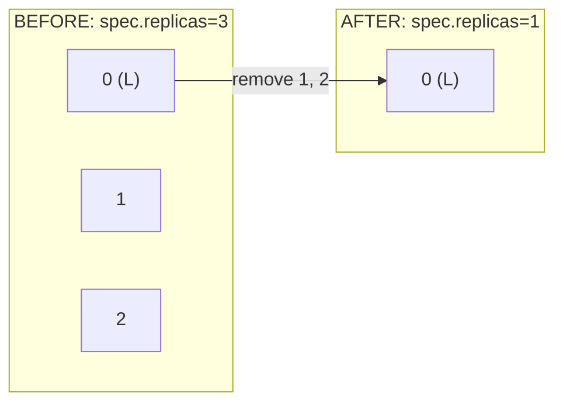
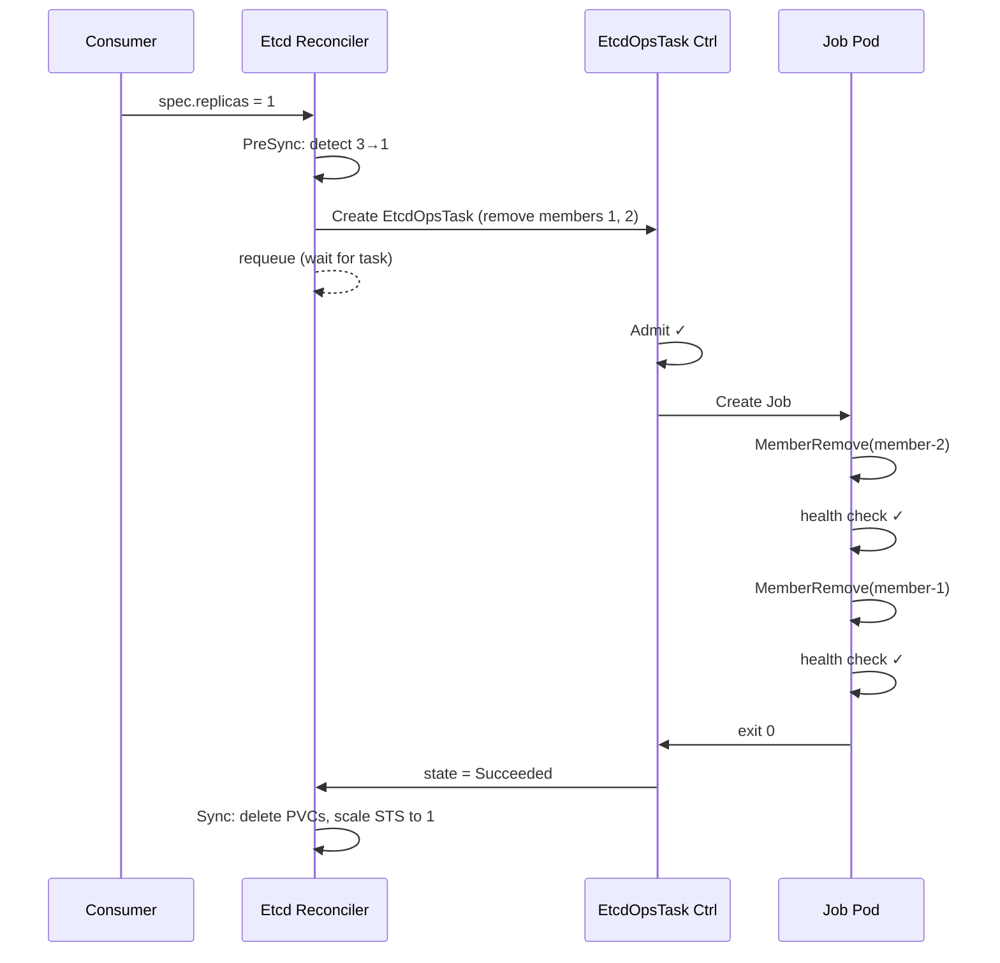
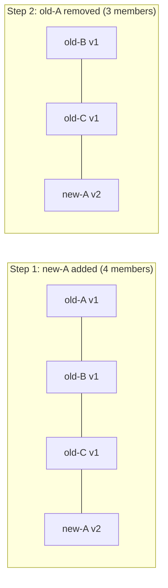
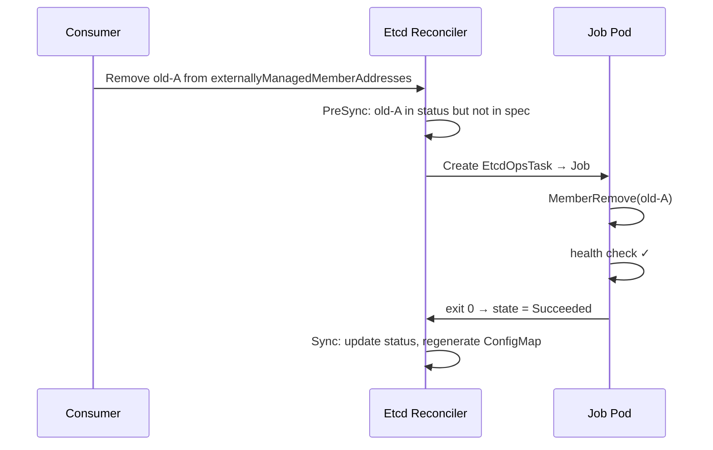
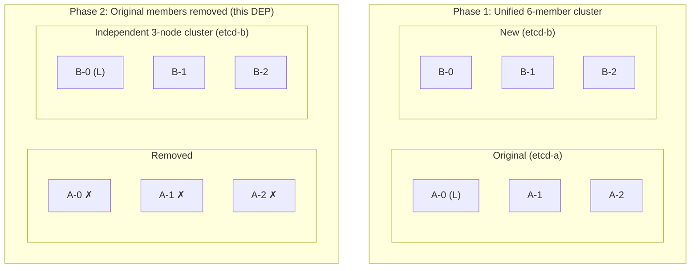
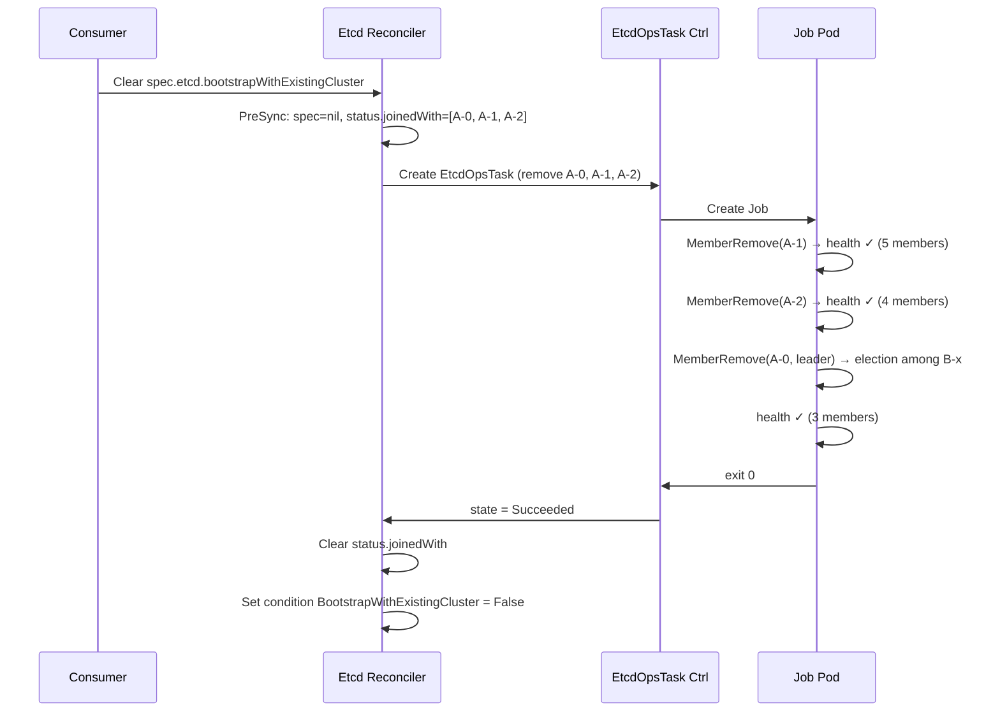

# DEP-07: Etcd Member Removal

## Table of Contents

- [Summary](#summary)
- [Terminology](#terminology)
- [Motivation](#motivation)
  - [Goals](#goals)
  - [Non-Goals](#non-goals)
- [Proposal](#proposal)
  - [Member Removal Trigger Mechanism](#member-removal-trigger-mechanism)
  - [Member Removal Execution](#member-removal-execution)
  - [Member Removal Detection (Anti-Rejoin)](#member-removal-detection-anti-rejoin)
  - [Notes and Constraints](#notes-and-constraints)
  - [Risks and Mitigations](#risks-and-mitigations)
- [Design Details](#design-details)
  - [EtcdOpsTask API Extension](#etcdopstask-api-extension)
  - [RemoveMembers Handler](#removemembers-handler)
  - [Member Removal Job Specification](#member-removal-job-specification)
  - [etcdbrctl member-remove Subcommand](#etcdbrctl-member-remove-subcommand)
  - [PreSync Detection Logic](#presync-detection-logic)
  - [Post-Removal Cleanup](#post-removal-cleanup)
  - [Failure Handling](#failure-handling)
- [Use Cases](#use-cases)
  - [Typical Scale-Down](#typical-scale-down)
  - [Externally Managed Member Rotation](#externally-managed-member-rotation)
  - [BootstrapWithExistingCluster — Member Removal](#bootstrapwithexistingcluster--member-removal)
- [Compatibility](#compatibility)
- [Drawbacks](#drawbacks)
- [Alternatives](#alternatives)
- [Open Questions](#open-questions)
- [References](#references)

---

## Summary

etcd-druid currently lacks the ability to remove members from a running etcd cluster programmatically. This DEP introduces a `RemoveMembers` task type within the [EtcdOpsTask](05-etcdopstask.md) framework that creates a Kubernetes Job to sequentially remove specified members with inter-removal health checks. The mechanism addresses scale-down, externally managed member rotation, and BootstrapWithExistingCluster member removal uniformly.

---

## Terminology

| Term | Definition |
|------|------------|
| **backup-restore sidecar** | The `etcd-backup-restore` container running alongside etcd in each member pod, responsible for snapshots, restoration, and initialization. |
| **etcdbrctl** | The CLI binary provided by `etcd-backup-restore`, used for out-of-band operations (compact, restore, snapshot, copy, and — with this DEP — member-remove). |
| **EtcdOpsTask** | A custom resource ([DEP-05](05-etcdopstask.md)) representing an out-of-band operator task on an etcd cluster. |
| **PreSync** | A reconciler phase that executes before Sync (resource creation/update). Operations here must complete before cluster configuration changes take effect. |
| **Externally managed members** | etcd members whose lifecycle is managed outside of etcd-druid by the consumer. Configured via `spec.externallyManagedMemberAddresses`. |
| **Bootstrap with existing cluster** | A mode where new Etcd CR members join an already-running etcd cluster managed by a different Etcd CR. Configured via `spec.etcd.bootstrapWithExistingCluster`. |
| **`members_removed` bucket** | A boltdb bucket in the etcd data directory. The backup-restore sidecar reads it during initialization to detect permanently removed members and prevent re-adding them as learners. |

---

## Motivation

etcd-druid can scale up an etcd cluster — add members as learners, promote them to voting members — but lacks the symmetric capability to **remove** members. Without member removal, three operations fail or require manual intervention:

1. **Scale-down.** When `spec.replicas` decreases (e.g., 3→1), the StatefulSet is scaled directly. Pods are terminated without first removing the corresponding members from the etcd membership. The cluster retains stale entries, and the backup-restore sidecar may attempt to re-add terminated members as learners on next initialization.

2. **Externally managed member rotation.** Consumers performing rolling updates of externally managed members ([PR #1214](https://github.com/gardener/etcd-druid/pull/1214)) add a new member address and then remove the old one from the spec. Without an etcd-level removal mechanism, old members remain in the cluster's member list indefinitely.

3. **BootstrapWithExistingCluster member removal.** When an Etcd CR bootstraps its members into an existing cluster via `bootstrapWithExistingCluster` ([Issue #1239](https://github.com/gardener/etcd-druid/issues/1239)), the original cluster's members must eventually be removed so that the new cluster operates independently. Without a removal mechanism, manual intervention is required.

> [!NOTE]
> These capabilities are consumed by higher-level orchestrators — for example, Gardener's Live Control Plane Migration ([GEP-0039](https://github.com/gardener/enhancements/tree/main/geps/0039-live-control-plane-migration)) and self-hosted shoot clusters ([GEP-0028](https://github.com/gardener/enhancements/tree/main/geps/0028-self-hosted-shoot-clusters)). Neither GEP defines a concrete member removal implementation; this DEP provides it.

### Goals

1. Provide a unified mechanism to remove one or more etcd members from a running cluster, usable across all three scenarios.
2. Ensure member removal completes **before** StatefulSet pod deletion to avoid split-brain or quorum loss.
3. Persist removal state so the backup-restore sidecar does not re-add removed members as learners.
4. Integrate with the existing EtcdOpsTask lifecycle (state machine, duplicate prevention, TTL-based garbage collection).
5. Support both TLS-enabled and plaintext etcd clusters.
6. Ensure idempotent behavior — removing an already-absent member is a no-op.

### Non-Goals

1. **Automatic leader transfer.** No explicit `MoveLeader` RPC is issued before removing the leader. etcd's built-in leader election handles this, typically incurring a 1-2 second election pause.
2. **Quorum recovery.** If removal causes quorum loss, recovery is handled by the existing QuorumRecovery OpsTask — not this mechanism.
3. **Scale-down to zero.** Hibernation (`replicas=0`) is a separate path with its own pre-sync snapshot. Single-node clusters (`replicas=1`) cannot be scaled down further via this mechanism.
4. **Concurrent member removal.** Members are removed sequentially with health checks in between. Parallel removal is explicitly not supported.

---

## Proposal

### Member Removal Trigger Mechanism

A new `RemoveMembers` configuration type is added to `EtcdOpsTaskConfig`. The etcd reconciler's PreSync phase detects when member removal is required — by comparing spec against current cluster state — and creates an EtcdOpsTask. The reconciler requeues until the task completes before proceeding with StatefulSet mutations.

### Member Removal Execution

A `RemoveMembers` handler is registered in the EtcdOpsTask controller's handler registry. Unlike the `OnDemandSnapshot` handler (which makes HTTP calls to the sidecar), this handler creates a Kubernetes **Job** running `etcdbrctl member-remove`. The Job-based approach is chosen for these reasons:

1. Members to be removed may reside on a remote cluster (BootstrapWithExistingCluster case) — a Job can be configured with appropriate network access and credentials.
2. A dedicated Job provides process isolation — member removal does not risk crashing the sidecar.
3. Job logs provide an audit trail for the removal operation.
4. The Job mounts the same TLS secrets as the backup-restore container, following existing patterns.

### Member Removal Detection (Anti-Rejoin)

The `etcdbrctl member-remove` command writes removed member entries to the `members_removed` boltdb bucket. The backup-restore sidecar already checks this bucket during initialization ([`IsMemberRemovedFromDB()`](https://github.com/gardener/etcd-backup-restore/blob/master/pkg/member/member_removal_detection.go)) and refuses to re-add members found there.

### Notes and Constraints

- The `members_removed` boltdb bucket resides on the **local** etcd data volume. For the BootstrapWithExistingCluster case — where removed members belong to a different cluster — the boltdb write may not be possible from the Job. The sidecar's leader election loop detecting member absence serves as a fallback.
- The Job uses the `etcd-backup-restore` image from the same image vector as the sidecar, ensuring version consistency.
- The `RemoveMembers` handler introduces a Job-creation pattern to the EtcdOpsTask framework. Future handlers may adopt the same pattern.

### Risks and Mitigations

| Risk | Impact | Mitigation |
|------|--------|------------|
| Member removal causes quorum loss | Cluster unavailable | Admit phase rejects if resulting membership would have fewer than `(N/2)+1` members; health checks between removals detect quorum loss early |
| Job fails midway (partial removal) | Inconsistent membership | Idempotent design — re-running skips already-removed members; OpsTask retry creates a new Job |
| TLS secrets rotated during execution | Job loses connectivity | `activeDeadlineSeconds=300`; TLS rotation is infrequent and unlikely to overlap |
| Race between PreSync and status update | Duplicate OpsTask creation | EtcdOpsTask controller rejects duplicates for the same Etcd CR |
| backup-restore re-adds member before boltdb write | Member reappears | Detection runs **before** the scale-up check in the initializer; sequential execution ensures the write precedes pod restart |

---

## Design Details

### EtcdOpsTask API Extension

A `RemoveMembers` field is added to `EtcdOpsTaskConfig`:

```go
// EtcdOpsTaskConfig holds the configuration for the specific operation.
// +kubebuilder:validation:MinProperties=1
// +kubebuilder:validation:MaxProperties=1
type EtcdOpsTaskConfig struct {
    // +optional
    OnDemandSnapshot *OnDemandSnapshotConfig `json:"onDemandSnapshot,omitempty"`

    // RemoveMembers defines the configuration for removing members from the etcd cluster.
    // +optional
    RemoveMembers *RemoveMembersConfig `json:"removeMembers,omitempty"`
}
```

```go
// RemoveMembersConfig defines the configuration for an etcd member removal task.
type RemoveMembersConfig struct {
    // MembersToRemove is the list of members to be removed from the etcd cluster.
    // Members MUST be removed sequentially — non-leader members first, leader last.
    // +kubebuilder:validation:Required
    // +kubebuilder:validation:MinItems=1
    MembersToRemove []MemberToRemove `json:"membersToRemove"`
}

// MemberToRemove identifies a single etcd member to be removed.
type MemberToRemove struct {
    // Name is the member name as known to the etcd cluster.
    // +kubebuilder:validation:Required
    // +kubebuilder:validation:MinLength=1
    Name string `json:"name"`

    // PeerURL is the peer URL of the member, used to identify it in the cluster's member list.
    // +kubebuilder:validation:Required
    // +kubebuilder:validation:MinLength=1
    PeerURL string `json:"peerUrl"`
}
```

> [!NOTE]
> The client endpoint used to connect to the etcd cluster is derived by the handler from the Etcd CR's client service (`<etcd-name>-client.<namespace>.svc:<client-port>`). It is not specified in the OpsTask config.

**Example:**

```yaml
apiVersion: druid.gardener.cloud/v1alpha1
kind: EtcdOpsTask
metadata:
  name: remove-members-etcd-main-0
  namespace: my-namespace
  ownerReferences:
    - apiVersion: druid.gardener.cloud/v1alpha1
      kind: Etcd
      name: etcd-main
      controller: true
      blockOwnerDeletion: true
spec:
  etcdName: etcd-main
  config:
    removeMembers:
      membersToRemove:
        - name: etcd-main-1
          peerUrl: "https://etcd-main-1.etcd-main-peer.my-namespace.svc:2380"
        - name: etcd-main-2
          peerUrl: "https://etcd-main-2.etcd-main-peer.my-namespace.svc:2380"
  ttlSecondsAfterFinished: 3600
```

### RemoveMembers Handler

The handler implements the existing `Handler` interface ([`Admit`/`Execute`/`Cleanup`](05-etcdopstask.md)):

```go
func (h *removeMembersHandler) Admit(ctx context.Context) handler.Result {
    // 1. Fetch the referenced Etcd object
    // 2. Verify etcd cluster is ready (AllMembersReady condition)
    // 3. MUST reject if resulting cluster retains fewer than (N/2)+1 members
    // 4. MUST reject if spec.replicas == 1
}

func (h *removeMembersHandler) Execute(ctx context.Context) handler.Result {
    // 1. Check if Job already exists — requeue if still active
    // 2. Build Job spec with etcdbrctl member-remove args
    // 3. Create Job
    // 4. Poll Job completion (requeue with interval)
    // 5. Return success/failure based on Job status
}

func (h *removeMembersHandler) Cleanup(ctx context.Context) handler.Result {
    // Delete the Job with foreground propagation policy
}
```

Registration in the default handler registry:

```go
func DefaultTaskHandlerRegistry() handler.TaskHandlerRegistry {
    registry := handler.NewTaskHandlerRegistry()
    registry.Register("OnDemandSnapshot", ondemandsnapshot.New)
    registry.Register("RemoveMembers", removemembers.New)
    return registry
}
```

### Member Removal Job Specification

The Job follows the pattern established by the compaction controller:

```yaml
apiVersion: batch/v1
kind: Job
metadata:
  name: etcd-main-member-remove-a7f3b2
  namespace: shoot--myproject--mycluster
  ownerReferences:
    - apiVersion: druid.gardener.cloud/v1alpha1
      kind: EtcdOpsTask
      name: remove-members-etcd-main-0
      controller: true
      blockOwnerDeletion: true
  labels:
    app.kubernetes.io/name: etcd-main-member-remove
    app.kubernetes.io/component: etcd-member-removal-job
    networking.gardener.cloud/to-dns: allowed
    networking.gardener.cloud/to-private-networks: allowed
spec:
  activeDeadlineSeconds: 300
  completions: 1
  backoffLimit: 3
  template:
    spec:
      serviceAccountName: etcd-main
      restartPolicy: Never
      terminationGracePeriodSeconds: 30
      containers:
        - name: member-remove
          image: europe-docker.pkg.dev/gardener-project/releases/gardener/etcdbrctl:v0.43.0
          imagePullPolicy: IfNotPresent
          args:
            - member-remove
            - "--member=etcd-main-1=https://etcd-main-1.etcd-main-peer.shoot--myproject--mycluster.svc:2380"
            - "--member=etcd-main-2=https://etcd-main-2.etcd-main-peer.shoot--myproject--mycluster.svc:2380"
            - "--endpoints=https://etcd-main-client.shoot--myproject--mycluster.svc:2379"
            - "--cacert=/var/etcd/ssl/ca/bundle.crt"
            - "--cert=/var/etcd/ssl/client/tls.crt"
            - "--key=/var/etcd/ssl/client/tls.key"
          volumeMounts:
            - name: etcd-ca
              mountPath: /var/etcd/ssl/ca
              readOnly: true
            - name: etcd-client-tls
              mountPath: /var/etcd/ssl/client
              readOnly: true
          resources:
            requests:
              cpu: 100m
              memory: 128Mi
          securityContext:
            allowPrivilegeEscalation: false
      volumes:
        - name: etcd-ca
          secret:
            secretName: etcd-main-ca-bundle
        - name: etcd-client-tls
          secret:
            secretName: etcd-main-client-tls
```

> [!NOTE]
> For non-TLS clusters, the `--cacert`, `--cert`, and `--key` flags are omitted and TLS volumes are not mounted.

> [!NOTE]
> The Job does not interact with the Kubernetes API — it communicates directly with etcd using TLS client certificates. The `serviceAccountName` is set to the etcd StatefulSet's service account for consistency with pod security policies and image pull secrets, but no RBAC bindings are required for the Job's operation.

### etcdbrctl member-remove Subcommand

A new cobra subcommand is added to `etcdbrctl`:

```
etcdbrctl member-remove \
  --member=etcd-main-1=https://etcd-main-1.etcd-main-peer.shoot--myproject--mycluster.svc:2380 \
  --member=etcd-main-2=https://etcd-main-2.etcd-main-peer.shoot--myproject--mycluster.svc:2380 \
  --endpoints=https://etcd-main-client.shoot--myproject--mycluster.svc:2379 \
  --cacert=/var/etcd/ssl/ca/bundle.crt \
  --cert=/var/etcd/ssl/client/tls.crt \
  --key=/var/etcd/ssl/client/tls.key \
  --data-dir=/var/etcd/data
```

The `--member` flag is repeatable. Each value uses the format `<name>=<peerURL>` where `=` separates the member name from the peer URL (the `=` delimiter avoids ambiguity with `://` and `:port` in URLs).

**Algorithm:**

1. Parse `--member` flags into a list of `(name, peerURL)` pairs.
2. Connect to the etcd cluster using `--endpoints` and TLS credentials.
3. Call `MemberList()` to retrieve current cluster members.
4. Identify the current leader.
5. Sort members to remove: non-leaders first, leader last.
6. For each member:
   - a. Re-fetch the current leader (it may have changed after the previous removal).
   - b. If this member is now the leader and there are remaining members to remove that are non-leaders, defer it and continue with the others first.
   - c. Match peerURL to find the member ID. If not found, log a warning and skip (idempotent). This covers the case where a member was already removed by a previous run.
   - d. If the member is a learner (non-voting), remove it directly — learner removal does not affect quorum.
   - e. Call `MemberRemove(memberID)`.
   - f. If `--data-dir` is specified, write member entry to the `members_removed` boltdb bucket.
   - g. Wait 5 seconds to allow the cluster to stabilize after the membership change. This interval accounts for the etcd election timeout (default 1s) plus raft log propagation and peer connectivity re-establishment.
   - h. Health-check the remaining members. If the cluster has fewer than `(N/2)+1` healthy members, exit non-zero immediately — do not proceed with further removals.
7. Exit 0.

### PreSync Detection Logic

The StatefulSet component's `PreSync()` method is extended:

```go
func (o *operator) PreSync(ctx context.Context, etcd *druidv1alpha1.Etcd) error {
    // ... existing hibernation/upgrade snapshot logic ...

    membersToRemove := computeMembersToRemove(etcd, existingSTS)
    if len(membersToRemove) > 0 {
        return o.ensureMemberRemovalTask(ctx, etcd, membersToRemove)
    }

    return nil
}
```

Detection logic per scenario:

| Scenario | Condition |
|----------|-----------|
| Typical scale-down | `etcd.Spec.Replicas < existingSTS.Spec.Replicas` — remove highest ordinals |
| External member removal | Entry present in `status.Members` but absent from `spec.ExternallyManagedMemberAddresses` |
| BootstrapWithExistingCluster member removal | `spec.Etcd.BootstrapWithExistingCluster == nil` AND `status.BootstrapWithExistingCluster.JoinedWith` is non-empty |

### Post-Removal Cleanup

After the `RemoveMembers` OpsTask succeeds, the next reconciliation proceeds through PreSync (task is now complete — returns nil) into Sync:

| Scenario | Sync Action |
|----------|-------------|
| Typical scale-down | Delete PVCs for removed ordinals, then scale StatefulSet to new replica count |
| External member removal | Remove entries from `status.Members`, regenerate ConfigMap |
| BootstrapWithExistingCluster member removal | Clear `status.bootstrapWithExistingCluster.joinedWith`, set condition `BootstrapWithExistingCluster` to `False` |

### Failure Handling

```
RemoveMembers OpsTask created
    │
    ├─ Admit fails (cluster not ready, quorum risk)
    │     → TaskState: Rejected (manual intervention required)
    │
    ├─ Execute: Job created
    │    ├─ Job succeeds → TaskState: Succeeded → PreSync proceeds to Sync
    │    │
    │    └─ Job fails → TaskState: Failed
    │         → PreSync creates new OpsTask on next reconcile (up to 3 attempts)
    │         → After 3 failures: log error, reconciler keeps requeuing
    │
    └─ Cleanup: Job deleted after TTL expiry
```

---

## Use Cases

### Typical Scale-Down

A consumer reduces `spec.replicas` from 3 to 1.



**Sequence:**



### Externally Managed Member Rotation

A consumer performs a rolling update (maxSurge=1) of externally managed members. For a 3-node HA cluster: add new member, remove old member, repeat three times.

**One iteration:**



This cycle repeats for each member: add new-B → remove old-B → add new-C → remove old-C.

**Sequence (single rotation):**



### BootstrapWithExistingCluster — Member Removal

An Etcd CR (etcd-b) bootstraps its members into an existing cluster managed by another Etcd CR (etcd-a). After the new members join and stabilize, the consumer clears `bootstrapWithExistingCluster` from the spec. etcd-druid detects this and removes the original members.

**Topology transition:**



**Trigger:** The consumer clears `spec.etcd.bootstrapWithExistingCluster`. PreSync detects that `status.bootstrapWithExistingCluster.joinedWith` still records the original members — this signals bootstrap is complete and the original members should be removed.

**Sequence:**



**Post-removal Etcd CR status:**

```yaml
apiVersion: druid.gardener.cloud/v1alpha1
kind: Etcd
metadata:
  name: etcd-b
spec:
  replicas: 3
status:
  members:
    - name: etcd-b-0
      status: Ready
      role: Leader
    - name: etcd-b-1
      status: Ready
      role: Member
    - name: etcd-b-2
      status: Ready
      role: Member
  conditions:
    - type: BootstrapWithExistingCluster
      status: "False"
      reason: BootstrapComplete
      message: "Original members removed. Cluster operating independently."
    - type: AllMembersReady
      status: "True"
```

The original cluster's pods (etcd-a) detect removal via the backup-restore sidecar's `IsMemberRemovedFromDB()` check or leader election loop and exit gracefully.

---

## Compatibility

- **API.** The `RemoveMembers` field is optional in `EtcdOpsTaskConfig`. Existing OpsTask resources with `OnDemandSnapshot` are unaffected.
- **etcd-druid.** Older versions that lack the `RemoveMembers` handler will reject such tasks with "unsupported task configuration."
- **etcd-backup-restore.** The `member-remove` subcommand is additive. If the image is too old, the Job exits with "unknown command" and the OpsTask transitions to Failed.
- **Kubernetes.** The Jobs API (`batch/v1`) is stable and universally available.

---

## Drawbacks

- **Job startup latency.** Creating a Job pod introduces ~10-30s of overhead compared to an in-process HTTP call. Acceptable for scale-down operations but adds to total operation time.
- **New execution pattern.** The Job-based handler diverges from the existing HTTP-call pattern (`OnDemandSnapshot`). This adds framework complexity.
- **boltdb write not always possible.** For the BootstrapWithExistingCluster case, original member data volumes are on a different cluster. The sidecar-level detection serves as a fallback.
- **Pod churn.** Each removal operation creates a short-lived pod. Clusters with frequent scale operations will see more Job pods.

---

## Alternatives

The following alternatives were evaluated against three criteria: (1) works uniformly across all three use cases including cross-cluster scenarios, (2) does not introduce new attack surface, and (3) integrates with the existing EtcdOpsTask lifecycle without duplicating infrastructure.

| Alternative | Cross-cluster | No new attack surface | OpsTask integration |
|-------------|:---:|:---:|:---:|
| **Job-based (chosen)** | ✓ | ✓ | ✓ |
| HTTP endpoint on sidecar | ✗ | ✗ | ✓ |
| HTTP to leading sidecar | ✗ | ✗ | ✗ |

### HTTP Endpoint on Sidecar

Add a `/member/remove` HTTP endpoint to the backup-restore sidecar.

**Rejected because:** Increases the sidecar's attack surface; does not work when original members are on a different cluster (BootstrapWithExistingCluster case); couples the operation to sidecar availability.

### HTTP to Leading Sidecar (GEP-0039 Reference)

[GEP-0039](https://github.com/gardener/enhancements/tree/main/geps/0039-live-control-plane-migration) references member removal "using the GEP-28 mechanism." However, neither GEP specifies a concrete implementation. The Job-based approach is preferred because:

- The leader may be on the original cluster (remote/unreachable from the new cluster's sidecar).
- A Job can be configured with the correct network policies and credentials regardless of leader location.
- No new HTTP attack surface — the operation is gated behind RBAC (Job creation).
- Works uniformly across all three scenarios.

---

## Open Questions

1. **Stabilization interval.** The 5-second delay between member removals is derived from etcd's default election timeout (1s) plus margin for raft log propagation. Should this be configurable via the `RemoveMembersConfig` API, or is a fixed value sufficient for all deployment sizes?

2. **Quorum source of truth.** The Admit phase validates quorum by checking `len(currentMembers) - len(toRemove) >= (N/2)+1`. Should `currentMembers` be fetched from the live etcd cluster (via `MemberList()`) or from `etcd.Status.Members`? The live cluster is authoritative but adds a network call; the status field is eventually consistent but always available.

3. **Partial failure semantics.** If 2 of 3 members are successfully removed but the third fails, the OpsTask transitions to Failed. On retry, a new Job is created. Should the new Job receive only the remaining (unremoved) member, or the full original list? The idempotent design handles either, but the former is more efficient.

---

## References

- [DEP-05: Operator Out-of-band Tasks (EtcdOpsTask)](05-etcdopstask.md)
- [Issue #1307: Support removal of etcd members when externally managed](https://github.com/gardener/etcd-druid/issues/1307)
- [Issue #1239: Bootstrap with existing cluster](https://github.com/gardener/etcd-druid/issues/1239)
- [PR #1214: Support for externally managed members](https://github.com/gardener/etcd-druid/pull/1214)
- [DEP-03: Scaling up an etcd cluster](03-scaling-up-an-etcd-cluster.md)
- [GEP-0039: Live Control Plane Migration](https://github.com/gardener/enhancements/tree/main/geps/0039-live-control-plane-migration) (consumer)
- [GEP-0028: Self-Hosted Shoot Clusters](https://github.com/gardener/enhancements/tree/main/geps/0028-self-hosted-shoot-clusters) (consumer)
